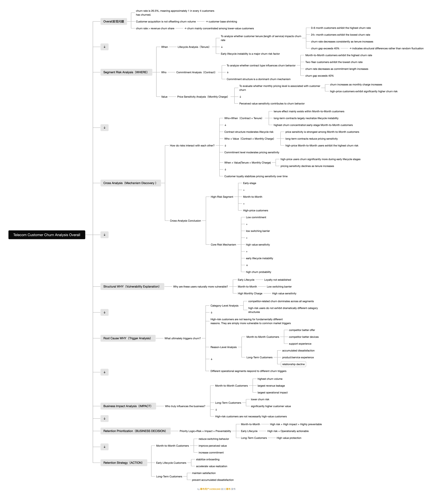
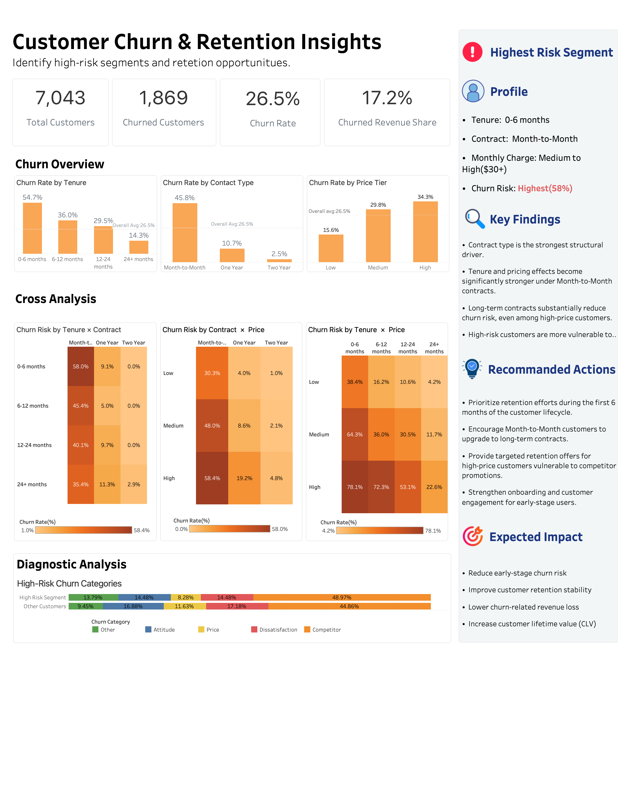
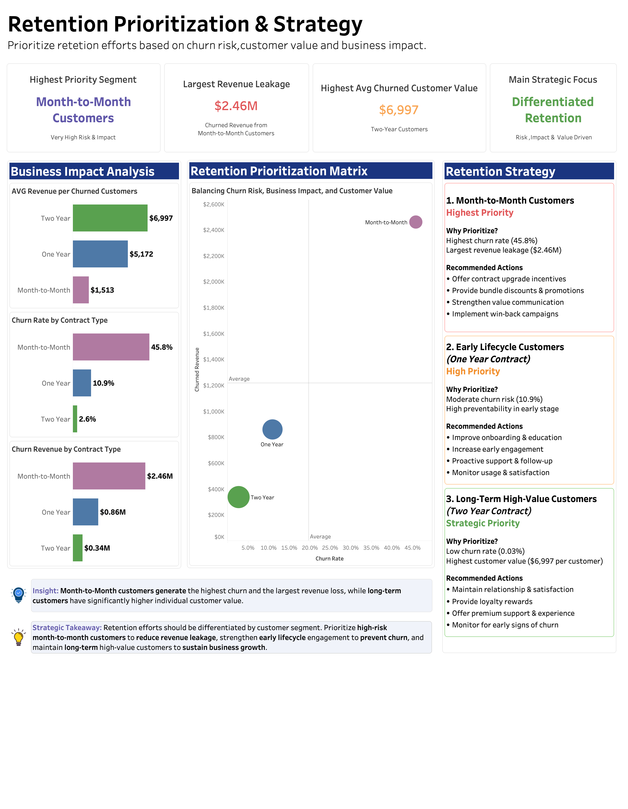

# Telecom Customer Churn Analysis

End-to-end churn analysis project focused on identifying high-risk customer segments, understanding churn drivers, and developing retention prioritization strategies for a telecom company.

---

## Project Overview

This project analyzes customer churn behavior in a telecom company using SQL and Tableau.

The analysis focuses on:

- identifying high-risk churn segments
- understanding structural churn drivers
- evaluating business impact
- developing retention prioritization strategies

The project combines exploratory analysis, cross-segment analysis, business impact evaluation, and retention strategy recommendations.

---

## Tools Used

- SQL
- Tableau
- Excel
- Power Query

---

## Analytical Framework



The analysis follows a structured business investigation framework:

Overall → Risk Segmentation → Cross Analysis → Root Cause Analysis → Business Impact → Retention Strategy

---

## Project Workflow

1. Data Cleaning & Validation
2. Exploratory Churn Analysis
3. Cross-Segment Risk Analysis
4. Root Cause Investigation
5. Business Impact Evaluation
6. Retention Prioritization
7. Strategy Recommendations

---

## Key Business Questions

- What is the overall churn situation?
- Which customer segments are most likely to churn?
- What factors are associated with churn?
- Which customer groups create the largest business impact?
- How should retention efforts be prioritized?

---

## Key Insights

- Month-to-Month customers exhibit the highest churn risk (45.8%)
- Early lifecycle customers (0–6 months) show significant churn instability
- Pricing sensitivity is strongest among low-commitment customers
- Month-to-Month customers generate the largest churn-related revenue leakage
- Long-term customers represent high-value strategic accounts

---

## Dashboard Preview

### Customer Churn & Retention Insights



### Retention Prioritization & Strategy



---

## Retention Strategy Recommendations

### High-Priority Segments

- Month-to-Month customers
- Early lifecycle customers
- High-price customers

### Recommended Actions

- contract upgrade incentives
- onboarding optimization
- targeted retention campaigns
- value communication strategies

---

## Repository Structure

```text
Telecom-Customer-Churn-Analysis/
│
├── SQL/
│   └── telecom-churn-analysis.sql
│
├── Dashboard/
│   └── telecom-churn-dashboard.twb
│
├── Images/
│   ├── framework.png
│   ├── churn-dashboard.png
│   └── retention-dashboard.png
│
├── Docs/
│   └── telecom-customer-churn-analysis.pdf
│
└── README.md
```

---

## Conclusion

This project demonstrates how churn analysis can move beyond descriptive reporting into business-driven retention strategy development through structured analytical thinking and cross-segment analysis.
